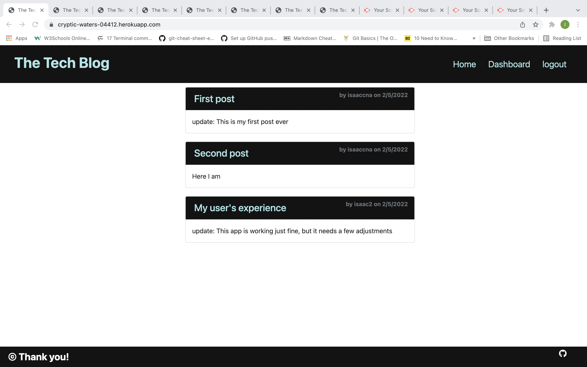
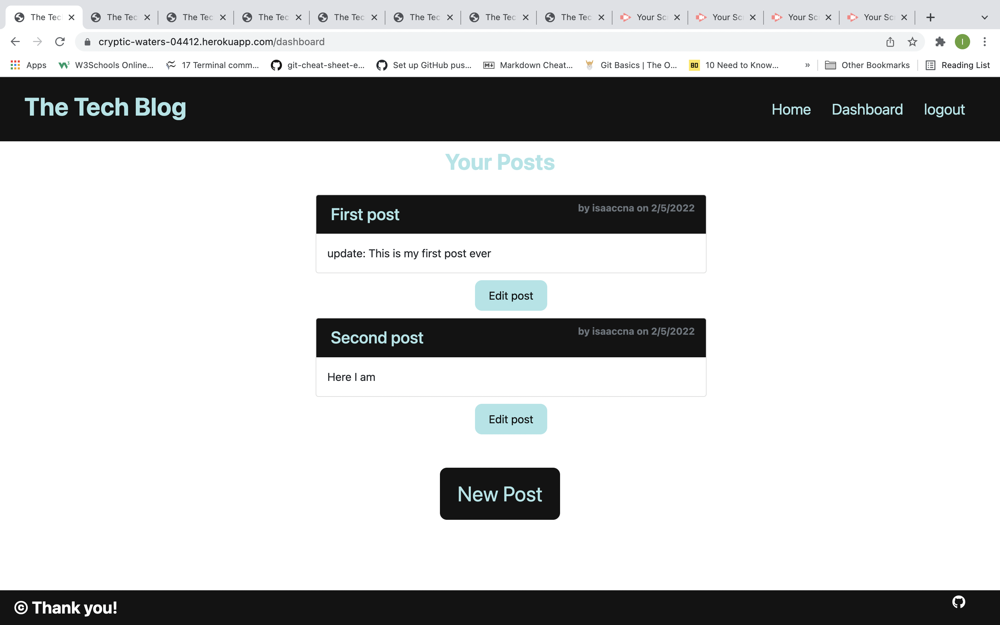
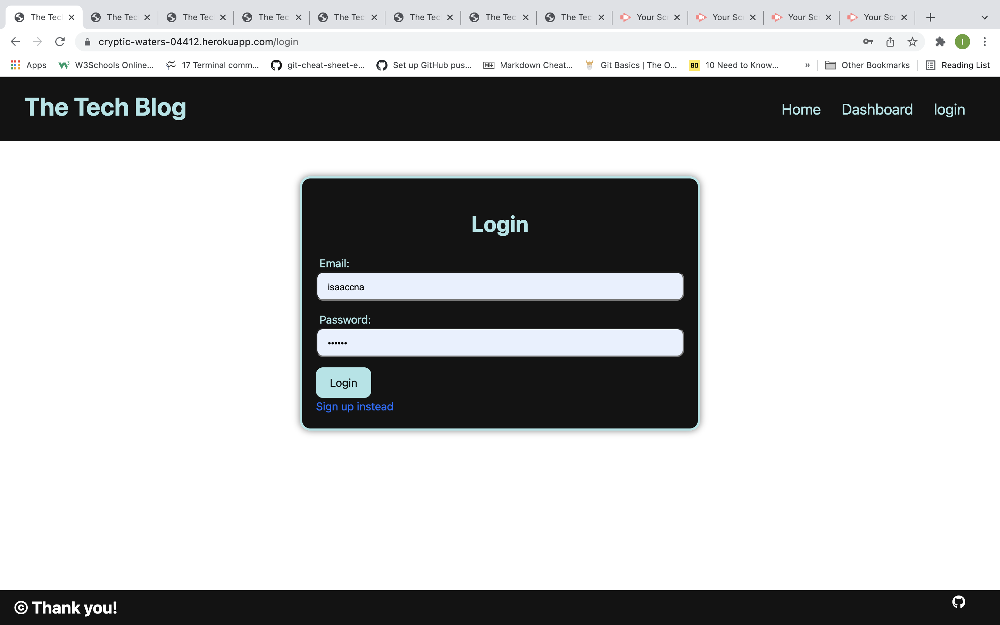
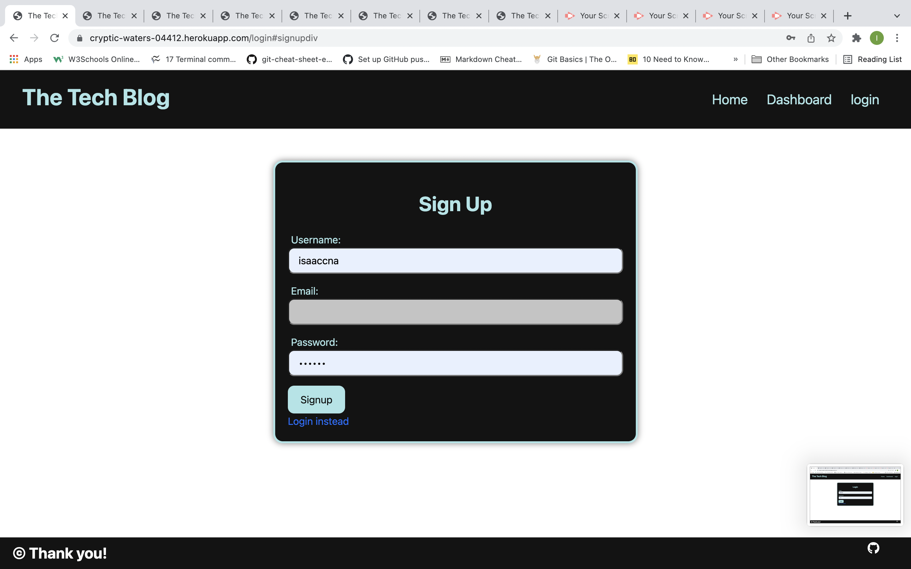
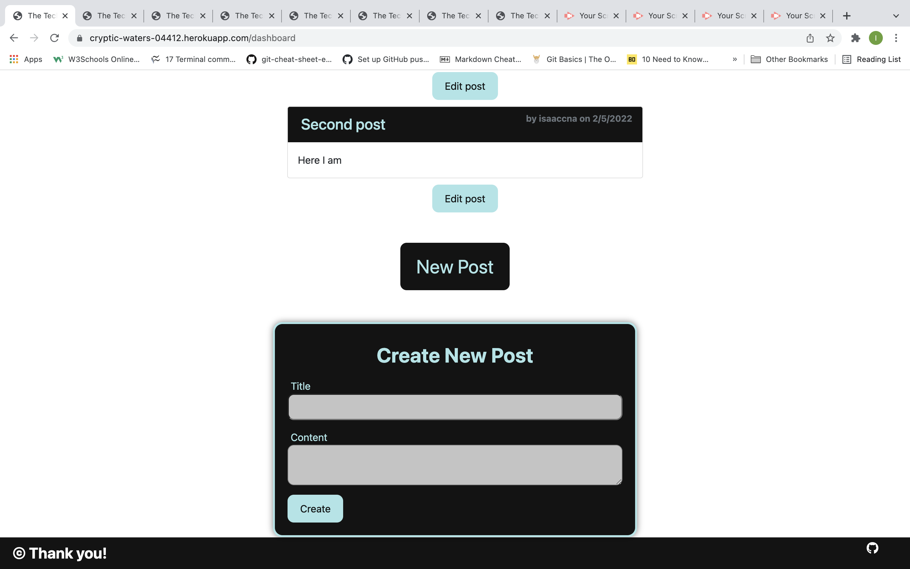
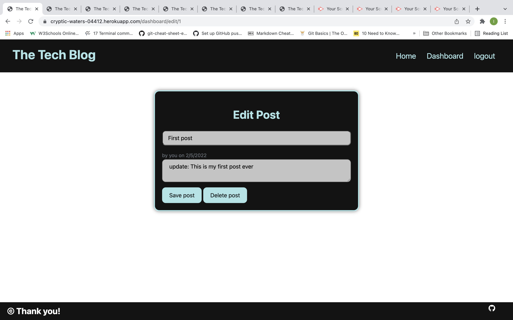
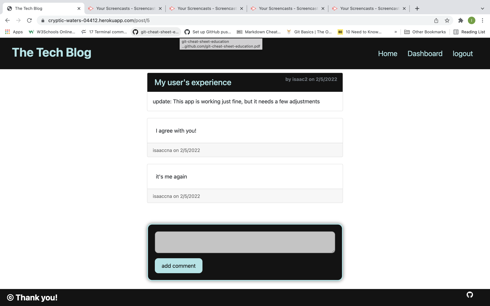

# The-Tech_Blog

## Overview
  This project was designed as a homework assignment for my coding bootcamp. The challenge was to builld a CMS-style blog , where developers can publish their posts and comment on other developers' posts as well. The site was built completely from the scratch and deployed to Heroku. The app follows the MVC oaradugm un its architectural structure, using Handlebars.js as the templating language, Sequelize as the ORM, and the express-session npm package for authentication.  

  ## Table of Contents
   - [Usage](#usage)
   - [Contributing](#contributing)
   - [Questions](#questions)

  ## Usage

  [Heroku](https://cryptic-waters-04412.herokuapp.com/)

   [Walkthrough video](https://watch.screencastify.com/v/L2P3pSWAHy3b3PQc7dlz)

   

   
   
   

  

  

  

  

  ## Contributing
   Isaaccna

  ## Questions
   For any questions about the project, please visit my:  
   GitHub Profile: [isaaccna](https://github.com/isaaccna)  
   or  
   Email: @ isaac.andrade1231@gmail.com